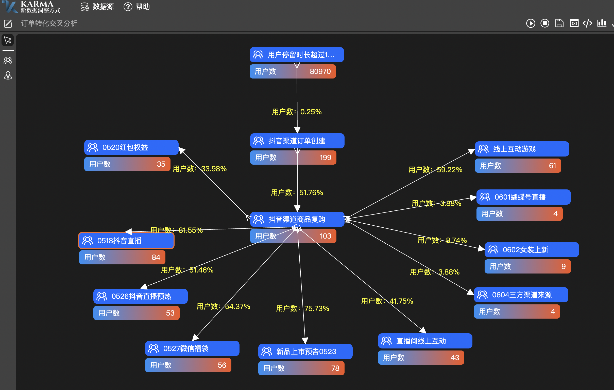
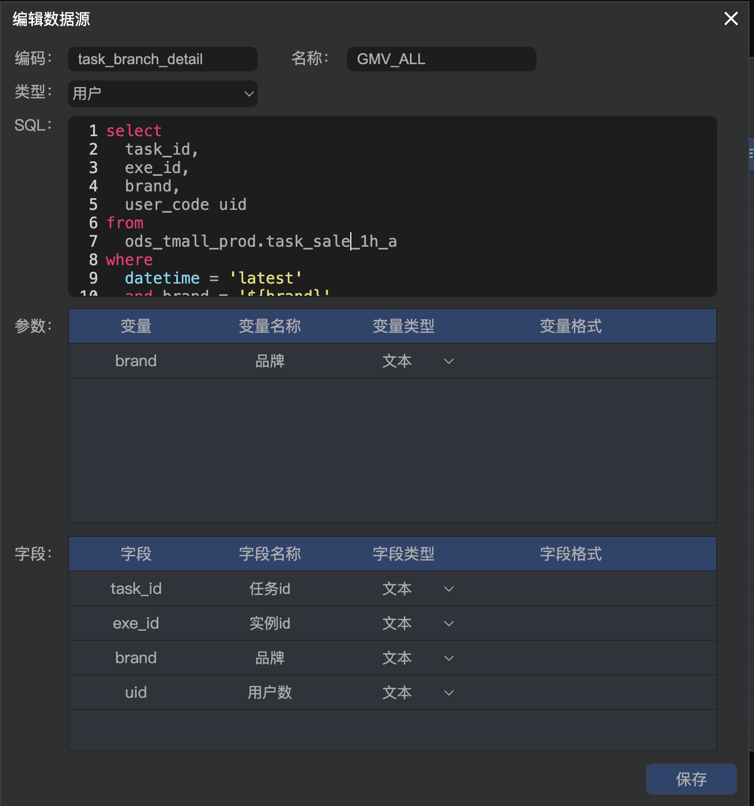
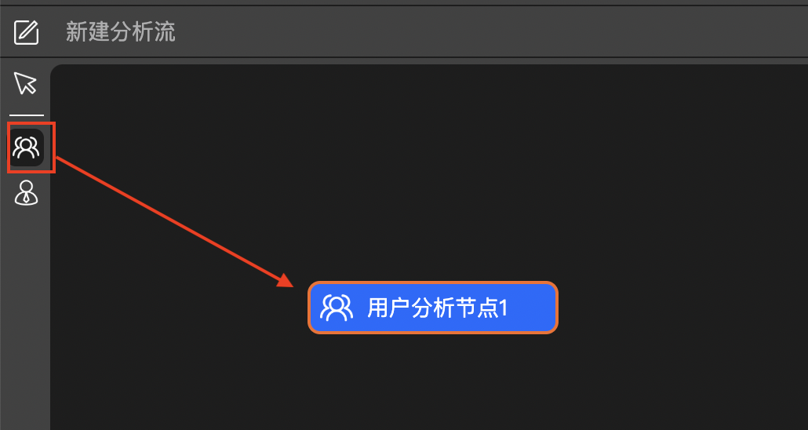
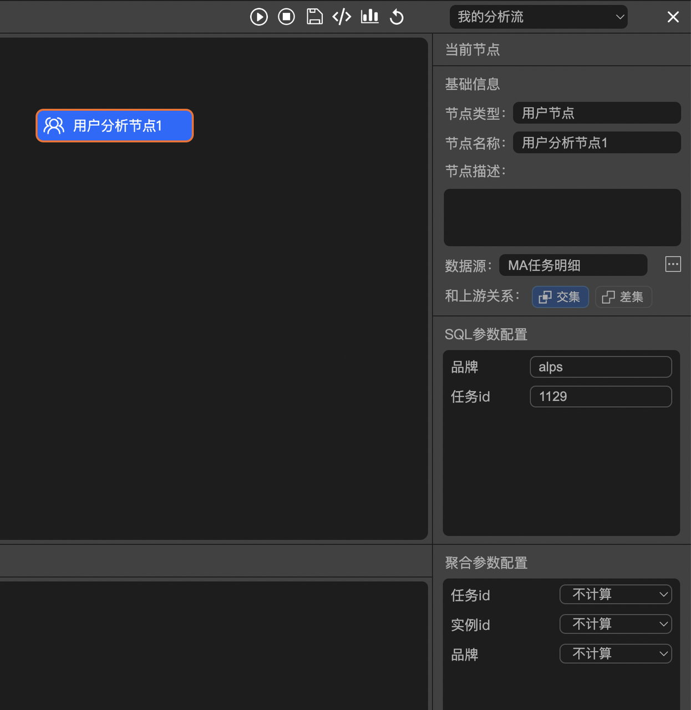
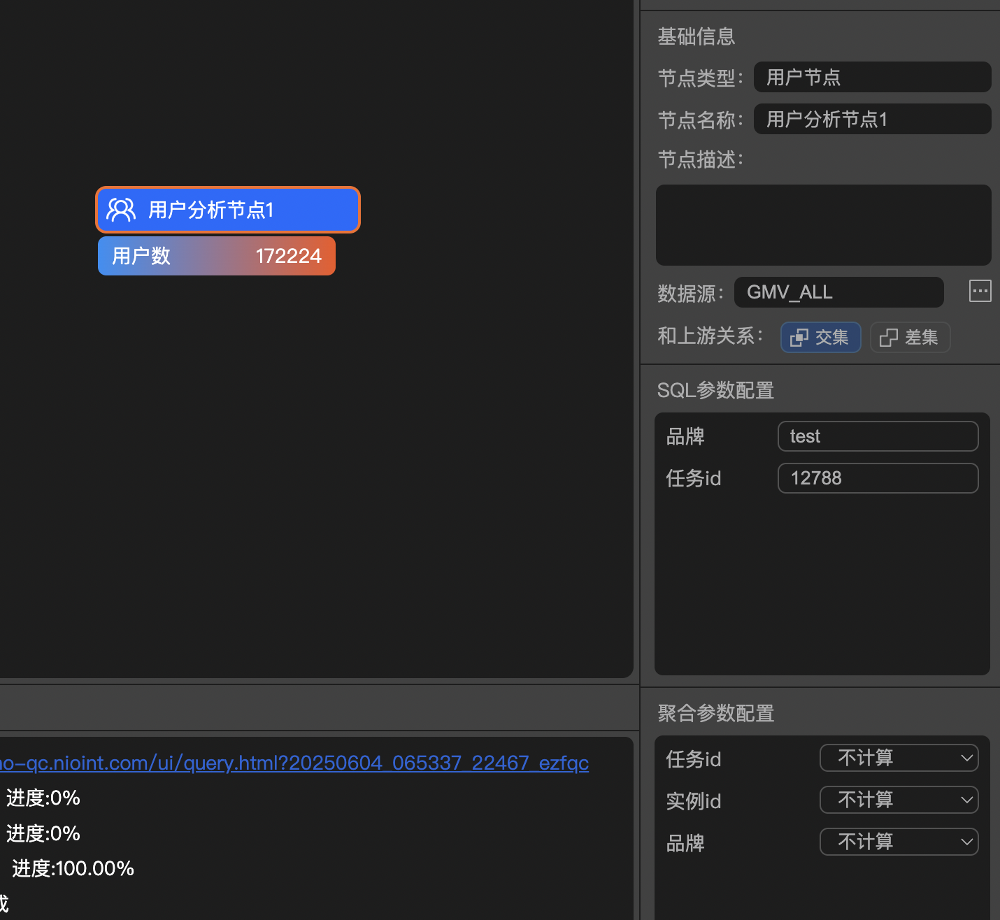
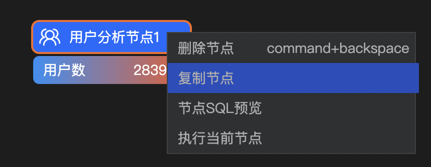
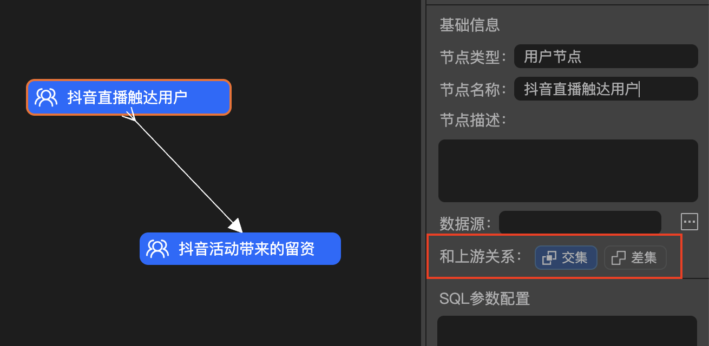
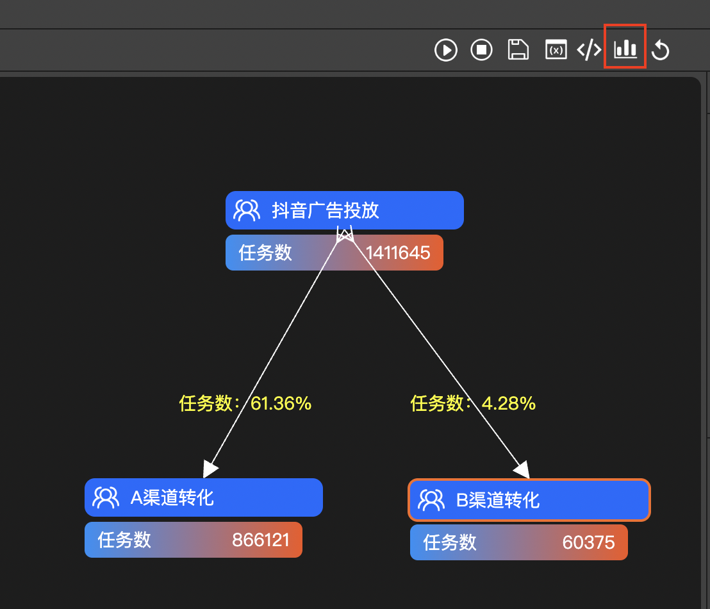
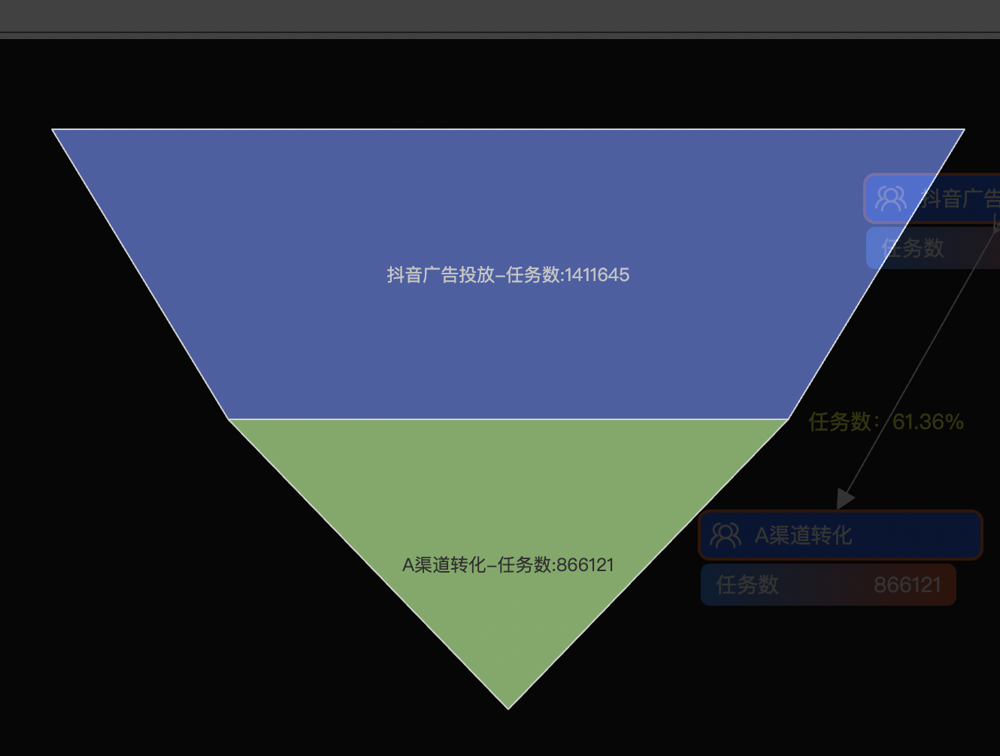
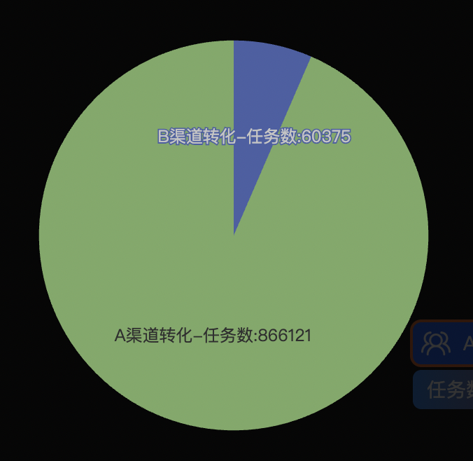

<div align=center>
  
</div>


<div align="center">
  <a href="javascript:;"></a>
  <a href="javascript:;"></a>
  <a href="javascript:;"></a>
  <a href="javascript:;"></a>
</div>

<br />

Karma是一种全新的数据洞察方式，用一句话表述就是**可执行的脑图**，多年前我曾向Sean Ellis（增长黑客之父）介绍了Karma的设计，他认为，Karma的模型是最好的企业数据分析方法。Karma有助于确定要进行实验的领域，也有助于从实验中得到结论。   

Karma将大大释放数据工程师和产品的工作，我们曾因为一些数据看板类的工作而投入大量前后端研发资源。而业务演进本身则迭代缓慢。数据固然重要，但投入大量资源则显得本末倒置，我们迫切需要一个这样的工具释放生产力。  

Karma填补了现有分析能力缺失的一环，和一些传统人群分析系统不同的是，传统分析聚焦某个确定的人群，基于这个人群运用各种分析手段得出结论。但这些分析没有建立数据之间联系，也缺乏面向业务的语义，比如业务想知道A活动真的带来了留资的提升吗，发出去的短信/push带来了多少曝光，这些用户后续n天的行为如何?参与某活动之前X天和之后X天用户的成交UV和GMV、核销、客单价如何变化等等。  

Karma将对数据的控制权和解释权交还给业务，最后采用何种方式得到何种结论，业务说了算。这是我认为Karma最为重要的特点，让业务探索问题并决策。  

<div align=center>
  
</div>

### 配置数据源

点击左上角，进入数据源配置窗口，点击右上角新增图标

  

这里定义在数据源中配置的内容是一段SQL，这个SQL原则上是单表查询即

```SQL
Select col1,col2,col3... from your_table where ...
```

这种简单结构。比如：

```SQL
select
  task_id,
  exe_id,
  brand,
  user_code uid
from
  ods_tmall_prod.task_sale_1h_a
where
  datetime = 'latest'
  and brand = '${brand}'
  and task_id = ${taskid}
```

越简单越好。Karma底层是基于Trino实现的，所以这里的SQL也是Trino的语法。

<table>
<tr>
  <td width=500>
  

    
  </td>
 <td width=400>
 
这里**编码**为英文，**名称**随意  

**类型**目前支持用户和销售，即你的SQL是用来分析用户还是销售。 

Karma会自动感知SQL中的字段，并将它们解析到下面的**字段**模块，你可以配置字段的名称，也可以不配置。这个名称用于结果的展示。  

配置**字段类型**，这里主要是为了区分文本和数字。  

在SQL中，你可以用 ${变量} 这样的格式表示变量，Karma会自动感知SQL中的变量，并将它们解析到下面的**参数**模块，你可以配置变量的名称、类型、以及格式（主要用于日期类型，如 yyyyMMddHH）
 
  </td>
</tr>
</table>

我们还需要在SQL选择一个字段，让它的别名为 **uid（unique id）**，这个字段实际上是类似于外键的作用，比如上面的例子中我们选择user_code为uid，Karma将基于这个uid和其他数据源配置的SQL组装起来。用户id、车辆id、message id等都可以作为uid。  
上面的例子中，我们配置了一个数据源，这个数据源暴露出2个变量brand和taskid，它们将在后面发挥重要作用。以此类推，我们配置好其他可能用到的数据源，确定对应的uid字段。

### 绘制分析流
<table>
<tr>
  <td width=500>
  

    
  </td>
  <td width=400>
 
选中左侧【用户】选项，在黑色面板任意位置按下，即可创建节点。

  </td>
</tr>
<tr>
  <td>
  


  </td>
  <td>

此时在面板右侧可以编辑节点的信息，最为重要的是【数据源】，单击【数据源】右侧的【...】按钮，在弹出的面板中双击对应的行，即可绑定数据源。
  </td>
</tr>
<tr>
  <td>
  


  </td>
  <td>

此时上面配置的brand和taskid也在【SQL参数配置】中被带出来了，根据需要进行配置。
下方的【聚合参数配置】可以计算除了uid之外的指标，比如订单总和等，可以根据需要配置。  </td>
</tr>
<tr>
  <td>
  


  </td>
  <td>
此时你已经配置好了第一个节点，可以点击上方的【运行】按钮试试。观察【控制台】日志和结果。下面我们进行第二个节点配置。
</td>
</tr>
<tr>
  <td>
  


  </td>
  <td>
用同样的方式创建第二个节点，也可以使用鼠标右键菜单的复制功能。
</td>
</tr>
<tr>
  <td>
  
  </td>
  <td>
配置好数据源和参数后，可以将它们连接上。这次要注意右侧的【与上游关系】配置，多数情况下选择默认的交集即可。如果你需要分析未参与活动用户的情况，需要选择差集选项。
</td>
</tr>

<tr>
  <td>
  
  </td>
  <td>
再次点击执行，获取结果，以此类推，你可以分析很多节点关系。
也可以通过鼠标右键，执行某个特定的节点或者预览这个节点产生的SQL。
点击连线可以删除连线
command+z 是撤销操作
</td>
</tr>
<tr>
  <td>
  
  
  
</td>
  <td>
现在按住command，选中多个节点，点击上方的【图表】按钮，Karma会根据节点间的拓扑关系，展示漏斗或者其他图表。
</td>
</tr>
<tr>
  <td>
  

</td>
  <td>
点击右上角的【代码】按钮，可以编辑这里的代码。将这个代码发给你的朋友，他将获得一个和你一样的流程图，一键复制。test、prod跨环境复制也不再话下。
</td>
</tr>
</table>

